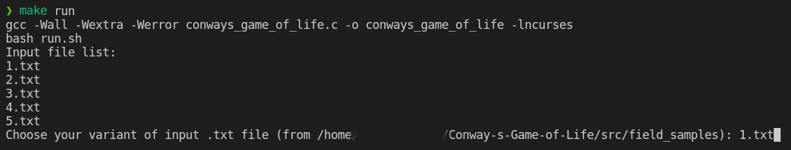

# <a href="https://en.wikipedia.org/wiki/Conway%27s_Game_of_Life">Conway's Game of Life</a>

## On MacOS:
for `<ncurses.h>` usage
```sh
brew install ncurses
```

### To run a game type:
```sh
make run
```
then choose a correct file from `field_samples/`

### Do not forget to type in shell name of game field file with `.txt` extension!
For example:



### To terminate the program press `q` button on keyboard or wait until the appearance of message on screen (shell):
```sh
GAME OVER
```
#
## On GNU\Linux (Ubuntu, Debian):
for `<ncurses.h>` usage
```sh
sudo apt-get update && sudo apt-get install libncurses5-dev libncursesw5-dev
```

### To run a game type:
```sh
make run
```
then choose a correct file from `field_samples/`

### Do not forget to type in shell name of game field file with `.txt` extension!
For example:


### To terminate the program press `q` button on keyboard or wait until the appearance of message on screen (shell):
```sh
GAME OVER
```
#
## On Windows (10):
### Download from Microsoft Store any Linux distributive (Ubuntu for example) - <a href="https://apps.microsoft.com/store/detail/ubuntu-on-windows/9NBLGGH4MSV6?hl=ru-ru&gl=RU">WSL</a>. And then run GNU\Linux commands in your system.
